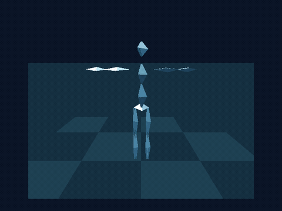

[English](README.md) | [日本語](README.ja.md)

# geo3d-motion-stage

**V9968 + geo3d搭載MSX向けの、カートリッジから起動する3Dダンスデモ**です。3人の低ポリゴン人物を **SCREEN 7 FIL・512×424・16色**で描き、過去姿勢、床への映り込み、独自PSG音楽を再生します。



起動後は無操作でデモを開始します。表示効果、人物選択、カメラ移動が同じ時間軸で進み、アプリ内のホワイトアウトと音楽フェードの後、自動で繰り返します。途中から手動操作もできます。

起動時に外部V9968を優先して自動検出し、なければ本体側V9968を使用します。選択した側のgeo3dが必須です。[検出・初期化・同期の仕様](docs/VDP.ja.md)。エミュレータの外部構成は `run-turbor.bat 8m external` または `run-msx2plus-cbios.bat 2m external` で起動できます。

## ダウンロード

| ROM | モーション／マッパー | FIL実装 |
|---|---|---|
| [MOTION8.ROM](dist/MOTION8.ROM) | 8 MiB・20 Hz・ASCII16-X | 検証用V9968 openMSX、R21 bit6 |
| [MOT8N.ROM](dist/MOT8N.ROM) | 8 MiB・20 Hz・ASCII16-X | native、R20 bit5 |
| [MOTION2.ROM](dist/MOTION2.ROM) | 2 MiB・10 Hz・ASCII16 | 検証用V9968 openMSX、R21 bit6 |
| [MOT2N.ROM](dist/MOT2N.ROM) | 2 MiB・10 Hz・ASCII16 | native、R20 bit5 |

ROM名は全て8.3形式です。**Nはnative FILの意味で、CPUの種類ではありません。** 各ROMがR800とZ80の両方に対応します。8 MiB版は従来の20 Hzの全姿勢を維持します。2 MiB版は1姿勢おきに保存し、座標と法線は16 bitの値を維持します。再生時間は短くなりません。

必要環境は **V9968 + geo3d・VRAM 256 KiB・主RAM 64 KiB以上**です。標準V9958だけでは動きません。R800を推奨し、Z80は効果併用時に低速です。アプリは60 Hzを明示的に選択します。native FILとFPGA実機の検証範囲は[検証結果](VERIFICATION.ja.md)で区別しています。

[全編デモ動画](dist/motion-stage-demo.mp4) · [R800比較](dist/comparison-r800.mp4) · [Z80比較](dist/comparison-z80.mp4) · [配布物とチェックサム](dist/README.ja.md)

## Windowsで起動

R21 bit6のFILを実装したWindows版[V9968 + geo3d openMSX](https://github.com/alexmoncks/openMSX)と機種のBIOSを用意してください。エミュレータ・BIOS本体は配布しません。

```powershell
powershell -NoProfile -ExecutionPolicy Bypass -File tools\setup-runtime.ps1 -EmulatorRoot C:\Tools\openMSX-V9968 -SystemROMs C:\MSX\systemroms -CBIOS C:\MSX\cbios
```

パスは例です。[実行環境](docs/RUNTIME.ja.md)に必要なBIOSファイルを記載しています。

```bat
run-turbor.bat 8m
run-turbor.bat 2m
run-msx2plus-cbios.bat 8m
run-msx2plus-cbios.bat 2m
```

容量を省略すると8 MiBを選びます。ローカルビルドがあればそれを使い、なければ`dist`のROMを使用します。BASICコマンド、ディスク、セーブ状態は不要です。これらのbatはopenMSX用FIL版を選びます。native版はR20 bit5に対応するエミュレータまたはFPGAで使用してください。

## 操作

| キー | 操作 |
|---|---|
| **D — Demo** | 自動デモを最初から開始 |
| 左右 | カメラ回転、最大±45度 |
| 上下 | カメラの上下方向の回転 |
| Shift＋上下 | 自動フィットの範囲でズーム |
| **T — Trails** | 過去姿勢を表示／非表示 |
| **R — Reflection** | 床への映り込みを表示／非表示 |
| **C — Character** | 全員→aachan→kashiyuka→nocchi→全員 |
| **M — Music** | デモを継続したままミュート／解除 |
| Space | 一時停止／再開 |
| **E — End** | 終了演出を早く開始 |
| Esc | 現在のモードを、初期カメラ・効果で再開始 |

カメラ、T/R/C、Space、Eの操作で、現在の場面を維持して手動モードへ移ります。手動モードの終了後は白画面を保持し、EscかDで再開します。自動モードは約70.5秒のモーションと1秒の白画面の後に繰り返します。次の最初の画面を描く時間だけ、CPUに応じた短い待ちが加わります。ミュート設定は自動ループでも保持します。

## ビルド

Windowsのz88dk、Windows PowerShell、.NET Frameworkを使用します。通常のビルド・起動にPython・WSLは不要です。

```bat
set Z88DK=C:\z88dk
build.bat
build-native.bat
```

それぞれ両容量を生成します。片方だけなら`build.bat 2m`や`build-native.bat 8m`を使います。出力は`build`以下の上記4ファイルです。容量とFIL方式は独立して選び、Cソースは共通です。2 MiB版はASCII16-Xの拡張アドレスを使わず、標準ASCII16のバンク書き込みを使用します。

公式プロジェクトの`aachan.bvh`、`kashiyuka.bvh`、`nocchi.bvh`を`assets`へ置いてください。SHA-256をオフラインで検査します。元のbakeはキャッシュします。BVHや`BvhBake.cs`を変更した場合は再変換してください。

```powershell
powershell -NoProfile -ExecutionPolicy Bypass -File tools\build-rom.ps1 -Profile all -Rebake
```

その後native版も再ビルドします。二次配布リポジトリから自動取得しません。メディア再生成だけFFmpegが必要です。[メディア生成](docs/MEDIA.ja.md)を参照してください。

## SX-2と小容量ROM機器

2 MiB版は**標準ASCII16**を使用し、データのバンク番号を128未満に収めています。SX-2系OCMファームウェアのASCII-16K ESE-MegaRAMモードを想定しています。ローダーでASCII16と適切なESE-MegaRAM機器を選択してください。V9968 + geo3dも必要で、標準SX-2のVDPだけでは不足します。個別のSX-2ローダー・ファームウェアと実機動作は未検証です。

一次資料の[OCM-PLD更新履歴](https://github.com/gnogni/ocm-pld-dev/blob/master/history.txt)に、SX-2対応とESE-MegaRAM ASCII-16Kの記載があります。8 MiB版は引き続き[ASCII16-X](https://www.grauw.nl/projects/ascii-x/ascii16-x/)を必要とします。

## モーションの出典

**BVHモーション：[Perfume global site project #001](https://perfume-global.com/web/2012/03/perfume-global-site-project-001/)。**

公式の一次プロジェクトが提供したBVHを変換してROMへ収録しています。同プロジェクトはBVHとMP3を提供しましたが、このデモはBVHのみを使用します。人体メッシュ、MSXビューアー、PSG音楽は新規制作です。公式MP3は使用・配布しません。独立した非公式ファンデモです。

公式記事で説明される、モーションを用いたファンの二次創作として制作しています。記事を包括的なオープンソースライセンスとは扱いません。[第三者資料](THIRD_PARTY.ja.md)に区別を記載しています。

## 技術資料

- [現行ROMの配置・デモ時計・描画](docs/DESIGN.ja.md)
- [検証結果・測定性能](VERIFICATION.ja.md)
- [初期版の技術解説・日本語PDF](docs/geo3d-motion-stage-technical-guide.ja.pdf)／[English PDF](docs/geo3d-motion-stage-technical-guide.en.pdf)

初期版PDFのデータ形式は、今回追加した事前計算の境界情報と2 MiB形式を含みません。現在のサイズとコードはDESIGNを参照してください。

機種定義の[MOTIONGT.xml](tools/machines/MOTIONGT.xml)と[MOTIONCB.xml](tools/machines/MOTIONCB.xml)だけに、元資料の[GPL-2.0](licenses/GPL-2.0.txt)表記を維持しています。アプリの新規コードやBVHにこの表記を適用せず、プロジェクト全体のMIT/GPLライセンスは表明していません。
